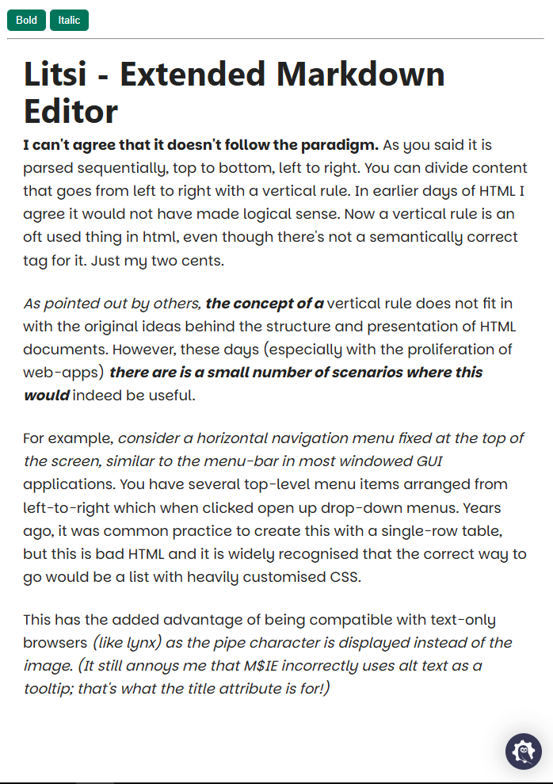

  
  
  
  

      

# 🌥️ Litsi 

 Litsi is an extended markdown editor based on Prosemirror and Lit, with easy to add custom component, inputrules, and dragable element (notion like).

    

## References

- [Stacks-Editor](https://github.com/StackExchange/Stacks-Editor)
- [Sakura CSS](https://oxal.org/projects/sakura/demo/)
- [Boxicon](https://boxicons.com/)

Work In Progress, Made with ♥️ by AH...
